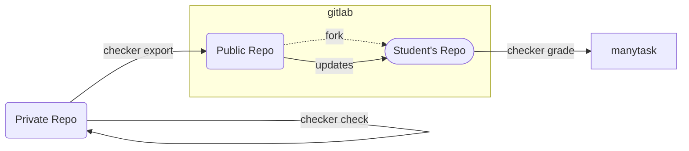

# Manytask Checker

[](https://github.com/manytask/checker/actions/workflows/test.yml)
[](https://github.com/manytask/checker/actions/workflows/publish.yml)
[](https://codecov.io/gh/manytask/checker)
[](https://github.com/manytask/checker/releases)
[](https://pypi.org/project/manytask-checker/)


Checker is a Python cli script to test students' solutions with built-in [manytask](https://github.com/yandexdataschool/manytask) integration.

* **production-like** - setup for students with gitlab-ci, language-specific testing etc 
* **customizable** - testing pipeline configuration via yaml files
* **extensible** - build-in plugins and ability to write custom plugins
  * [manytask](https://github.com/manytask/manytask) integration with plugin
  * gitlab merge-requests checks with plugin
  * etc
* **secure** - sandbox execution of students' code
* **fast** - lightweight script with testing parallelization

---


## How it works 

The `checker` lib is a part of the `manytask` ecosystem and extends its functionality.  
Please refer to the [manytask](https://github.com/manytask/manytask) documentation first to understand the drill.

> tl;dr: Manytask is a web application to manage students', repos, grades and deadlines.  
> It stores grades in google sheet and deadlines on a web page.  
> It also automatically creates gitlab repositories for students as forks from Public Repo with tasks and solution templates.  

So you have `Public Repo` and `Students' Repositories` and `Web App` to collect grades and deadlines.  

---

For the checker this setup extends with `Private Repo` with tasks, tests and solutions and `gitlab-ci` to run tests in.

The `checker` in a nutshell is a CLI script providing the following functionality:  
* **grade** - to run in a student's repository to test solution against private and public tests and push scores.
* **validate** - to run in a private (tutors') repository to validate tasks and deadlines integrity (will run in check automatically).
* **check** - to run in a private (tutors') repository to test gold solutions against private and public tests.
* **export** - to run in a private (tutors') repository to export tasks, templates and tests to the public repository.



The flow for tutors looks like:
* Have a manytask ready with empty public repo
* Create private repo with tasks, tests and solutions
* Configure checker with yaml files
* Make docker with your environment and checker installed
* Write ci file from students to run `checker grade` on each push/mr
* Setup private repo ci to run `checker check` on each push/mr
* Setup private repo ci to run `checker export` on each push/mr oor release or regularly or manually
* Profit!

The flow for students looks like:
* Register in manytask and get access to the public repo fork
* Clone this repo and start working on tasks
* Update from public repo regularly to get new tasks and tests
* Push your solution to gitlab where `checker grade` will run and push scores
* Profit!


It is a short description, please refer to the [checker docs](./docs) for more details.


## Installation 

The `checker` is available on pypi, so you can install it with pip
```shell
pip install manytask-checker
```

Or use pre-built docker image (you can base your image on it)
```shell
TBA
```


## Contributing

Really appreciate any contributions!  
For guidance on setting up a development environment see the [development guide](./docs/development.md).
For styleguide see organization [contribution guide](https://github.com/manytask/.github/CONTRIBUTING.md).


---

---

---

The `checker` lib is a relatively small cli script aiming to run tests in gitlab runner and push results to `manytask`. 


The full `checker` and `manytask` setup roughly looks as follows

* self-hosted `gitlab` instance - storing repos with assignments and students' repo  
  * private repo - a repository with tasks, public and private tests, gold solutions, ect.
  * public repo - a repository available to students with tasks and solution templates
  * students' group - the group where `manytask` will create repositories for students  
    each students' repo - fork from public repo
* `gitlab runners` - place where students' solutions likely to be tested 
* `checker` script - some script to test students' solutions and push scores/grades to the `manytask`  
* `manytask` instance - web application managing students' grades (in google sheet) and deadlines (web page)  


The flow for checking students' solution looks like: 

1. Student push his solution to a gitlab repo
2. gitlab-ci runs separate docker in gitlab-runner
3. gitlab-ci runs this script with some parameters
4. the script detect the latest changes (via git) and select tasks to check
5. the tasks forwarded to `tester` and it returns obtained scores 
6. the script push student scores to the manytask 

(additionally script can check ground-truth solutions, export new tasks etc)


## Usage 

### Pre requirements  

1. [manytask](https://github.com/yandexdataschool/manytask) web app
   Currently, this lib is integrated with manytask **only**, 
   so you need it to be set up first, see installation instructions in manytask repo.
2. gitlab with access to greate groups, users and add runners  
   This pre-requirement for manytask; See manytask installation instructions for more info
3. Created and tested [tester](./checker/testers) for your course/language 

### Preparations 

Obtain service keys for this script to operate 
1. manytask tester token you set up when run it
2. gitlab service user to operate with your repositories  
   (better to create a new one)

Create gitlab repositories layout 

1. Create private repository with tasks, public and private tests and ground-truth solution;  
   Choose one of the suitable layouts (see [driver.py](./checker/course/driver.py))  
   Grant access to your service account 
2. Create public empty repository  
   Grant access to your service account  
3. Create private (!) group for students repositories  
   (You have already done it if you set up manytask)  
   Grant access to your service account 

Edit config files in repository 

1. `.course.yml` - main endpoints config  
   (see [.course.yml example](./examples/.course.yml))
2. `.deadlines.yml` - task deadlines 
   (see [.deadlines.yml example](./examples/.deadlines.yml))
3. `.gitlab-ci.yml` - set up gitlab ci pipeline to test students tasks 
4. `.releaser-ci.yml` - set up gitlab ci pipeline to test new added tasks and build dockers

Setup dockers with env ready for testing, it's convenient to have 2 dockers: 

1. `base.docker` - base docker to build and test students solutions, install lib here 
2. `testenv.docker` - docker on top of base docker, to save tasks and tests


## Structure 

### Course

* **CourseConfig**  
  Manage course configuration. Wrapper around `.course.yml` file. 


* **CourseSchedule**  
  Manage course deadlines. Wrapper around `.deadlines.yml` file. 


* **CourseDriver**  
  Manage mapping of the Course to the Filesystem. (e.g. map Task to folders with tests and source files)  
  Available layouts are (see [driver.py](./checker/course/driver.py)):
  * `flat` - all tasks in root folder of the repo
  * `groups` - each group has its own folder


### Testing 

* **Executor** is object to run commands with some isolation level.  
  Available modes are: 

  * `sandbox` - separate process (clean env variables, nouser/nogroup, disabled network)  
  * `docker` - TODO
  

* **Tester** is object which can test single task: copy files, build, test it, cleanup.  
  Tester is extendable for each course/language. Now available:

  * `python`
